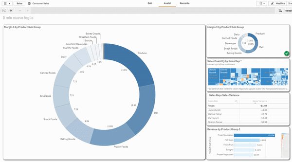
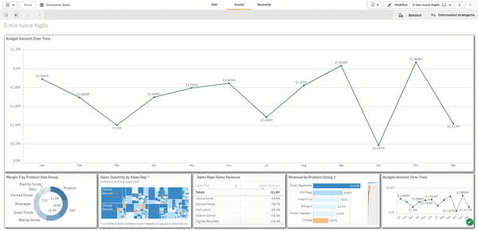
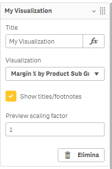
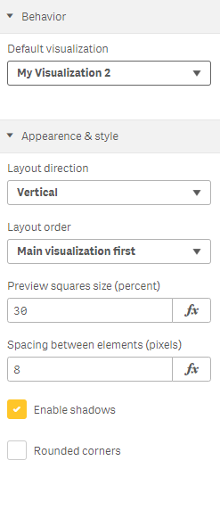

# Visualization Zapper

A visualization switcher with dynamic previews for Qlik Sense

Developed by [E-Project](http://e-projectsrl.it)

## Changes

### v.1.1.0

- Initial release

### v.1.1.1

- Fixed extension not working in Qlik Sense Desktop internal browser

### v.1.1.2

- Fixed main panel not expanding to full width in certain situations

### v.1.1.3

- Fixed extension not filling the container width when applying zoom to the page

## Introduction

Visualization Zapper is a custom Qlik Sense visualization extension that acts as a container for other visualizations, allowing you to switch between them on-the-fly. Compared to the tabbed container included by default in Qlik Sense, Visualization Zapper shows you a real-time preview of all the visualizations you added and allows you to chose between multiple layouts.

## Features

- Switch between any number of master visaulizations with a simple mouse clic
- Selected visualization is fully interactive, allowing selections and inputs
- Dynamic preview of all the visualizations, giving you an overview of all your data at a glance
- Preview visualizations react to selections and filters in real time
- Customize the layout direction and sorting for maximum flexibility

## Demo

Here are a couple of examples of the extension in use:

### 4 visualizations with horizontal layout and rounded corners

### 5 visualizations with vertical layout and squared corners:

## Usage

### Selecting the visualizations
After installing the extension, you will find it in the "E-Project extensions" bundle, under the name "Visualization Zapper".

Add it to the sheet, then from the properties panel click on `Visualizations` and add as many visualizations as you wish, using the provided drop-down menu to select the desired visualization.

For each visualization you can also tweak the following options:

- **Show titles/footnotes** - enable showing the titles/footnotes of the visualizations in the preview squares
- **Preview scaling factor** - apply a zoom factor to the visualization in the preview square (does not effect the main view)

### Behavior and style options

In the properties panel, select the `Zapper Settings` section to access the extension settings, which are described below:

#### Behavior settings

- **Default visualization** - lets you chose which visualization is displayed by default when the sheet loads

#### Layout and style

- **Layout direction** - "vertical" stacks the main visualization and the preview squares one on top of the other, "horizontal" puts them side by side
- **Layout order** - wether to draw the main visualization before the preview squares or vice-versa
- **Preview squares size** - percentage of the total extension size occupied by the preview squares
- **Spacing between elements** - spacing in pixels between the various elements of the extension
- **Enable shadows** - applies a box shadow around the main visualization and preview squares of the extension
- **Rounded corners** - switch style of the main visualization and preview squares corners

## License

This work is licensed under the Creative Commons Attribution-ShareAlike 4.0 International License. To view a copy of this license, see the `LICENSE.txt` present in this repository, visit http://creativecommons.org/licenses/by-sa/4.0/ or send a letter to Creative Commons, PO Box 1866, Mountain View, CA 94042, USA.